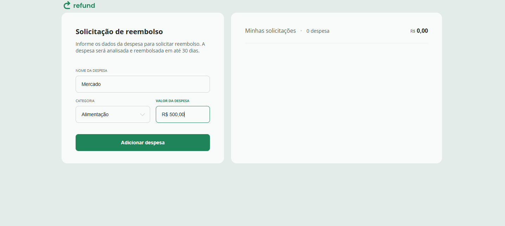
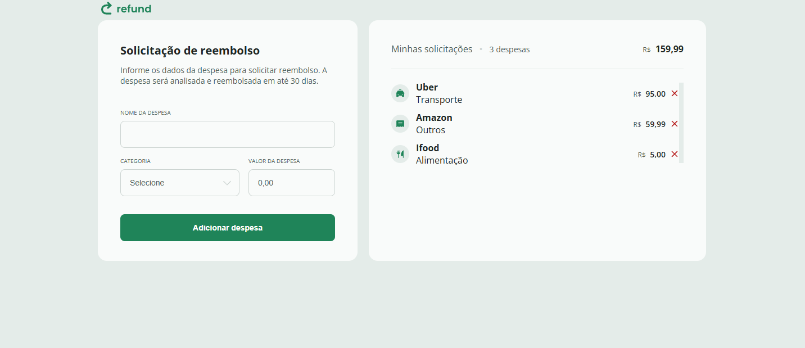

# Sistema de Reembolso

Este é um sistema de controle de despesas onde o usuário pode registrar despesas, atribuir categorias e visualizar o total das despesas. O sistema permite que o usuário adicione o nome da despesa, a categoria e o valor, exibindo as informações de forma organizada e calculando o total automaticamente.

## Funcionalidades

Cadastro de Despesas: O usuário pode inserir o nome da despesa, a categoria e o valor.
Exibição de Despesas: Após o cadastro, as despesas são exibidas em uma lista com o nome, categoria e valor.
Remover Despesas: A qualquer momento, é possível remover uma despesa da lista clicando no ícone de remoção.
Cálculo Automático do Total: O sistema calcula o total de todas as despesas registradas.
Interface Responsiva: A interface foi projetada para ser simples e intuitiva, com campos de entrada e visualização das despesas.

## Tecnologias Utilizadas

Frontend:

HTML5
CSS3
JavaScript

## Armazenamento:

O projeto não utiliza banco de dados, mas armazena os dados localmente durante a execução da página (pode ser implementado mais tarde com persistência em banco de dados, se necessário).

# Como Usar

## Passo 1: Instalar e Rodar o Projeto

Clone o repositório:

bash
Copiar código
git clone https://github.com/seu-usuario/sistema-de-reembolso.git
Entre na pasta do projeto:

bash
Copiar código
cd sistema-de-reembolso
Abra o arquivo index.html no seu navegador para rodar o sistema.

## Passo 2: Adicionar Despesas

Preencha o formulário:

Nome da Despesa: Insira o nome do gasto (exemplo: "Almoço").
Categoria: Selecione a categoria da despesa (exemplo: "Alimentação").
Valor: Insira o valor da despesa (exemplo: "50,00").
Clique em Adicionar Despesa para registrar a despesa.

A despesa será exibida na lista abaixo do formulário com o nome, categoria, e o valor formatado.

## Passo 3: Visualizar Total

O total das despesas será atualizado automaticamente à medida que novas despesas forem adicionadas ou removidas.

# Como Funciona

Entrada de Dados: O valor da despesa é formatado automaticamente para o padrão monetário brasileiro (R$).
Exibição de Despesas: Cada despesa é listada com seu nome, categoria, valor e um ícone de remoção.
Remoção de Despesas: Para remover uma despesa, basta clicar no ícone de remoção ao lado da despesa.
Atualização do Total: O total de despesas é recalculado automaticamente sempre que uma despesa é adicionada ou removida.
Interface
A interface é simples e responsiva, projetada para ser fácil de usar. Ao adicionar uma despesa, ela será imediatamente visível na lista com todos os detalhes.

# Imagens da Interface:

Tela Inicial (Cadastro de Despesa)

Tela com Despesas Cadastradas

# Contribuições

Sinta-se à vontade para contribuir com o projeto. Se você tem ideias de melhorias ou quer adicionar novas funcionalidades, crie uma issue ou envie um pull request.

# Licença

Este projeto está licenciado sob a Licença MIT - consulte o arquivo LICENSE para mais detalhes.

